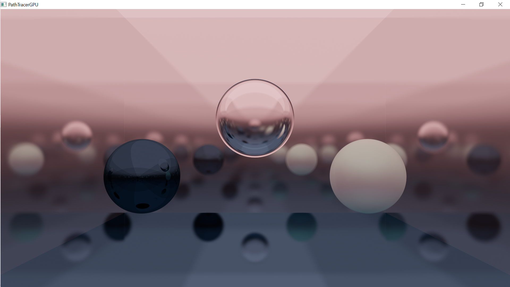

Another simple pathtracer referencing [Ray Tracing In One Weekend](https://raytracing.github.io/books/RayTracingInOneWeekend.html), [smallpt](http://www.kevinbeason.com/smallpt/) and [Demofox' great series](https://blog.demofox.org/2020/06/14/casual-shadertoy-path-tracing-3-fresnel-rough-refraction-absorption-orbit-camera/). Runs in a Directx11 compute shader. No dependencies except [lcf](https://github.com/dev-dwarf/lcf) and Windows' libraries.

Rendered scene showcasing diffuse/reflective/refractive/emissive materials. Rendered in 30 mins on my potatoe's Intel(R) UHD Graphics GPU.

